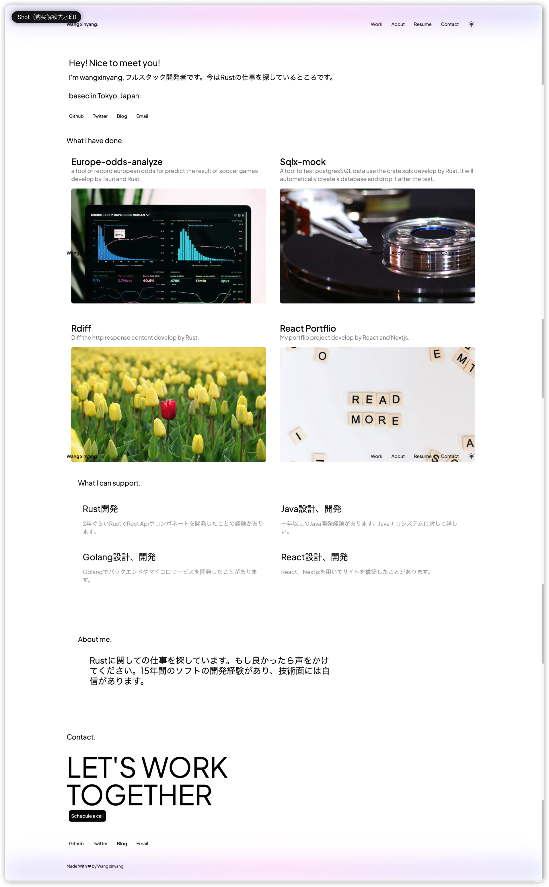
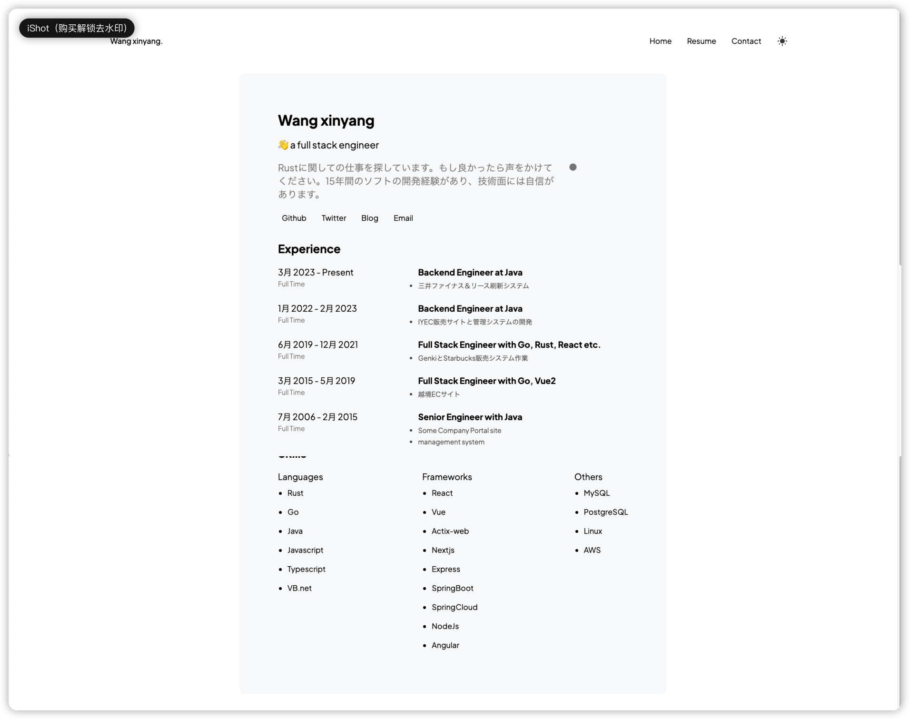
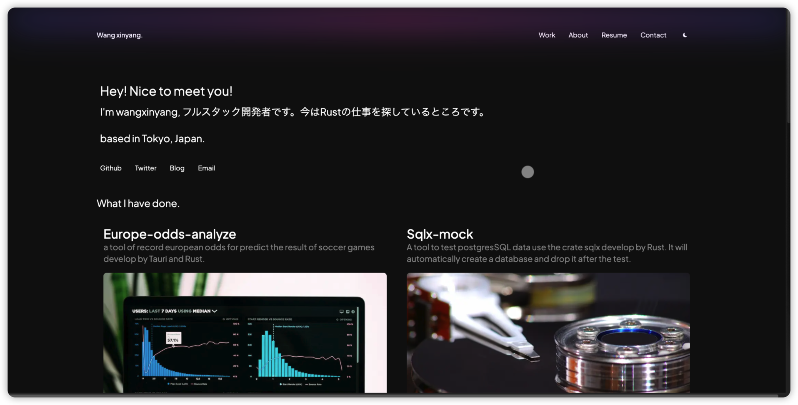

# Person-Portfolio

・個人のポートフォリオ
https://react-portfolio-olive-five.vercel.app/

## Stack

1. NextJS
2. React
3. tailwindcss

## Capture

## How to use it

1. yarn install
2. yarn build
3. yarn start
4. open the browser, input the url localhost:3000 to visit

## License

This project is distributed under the MIT.

See [LICENSE](https://github.com/wangxinyang/react-portfolio/blob/main/LICENSE) for details.

Copyright 2023 Xinyang Wang
